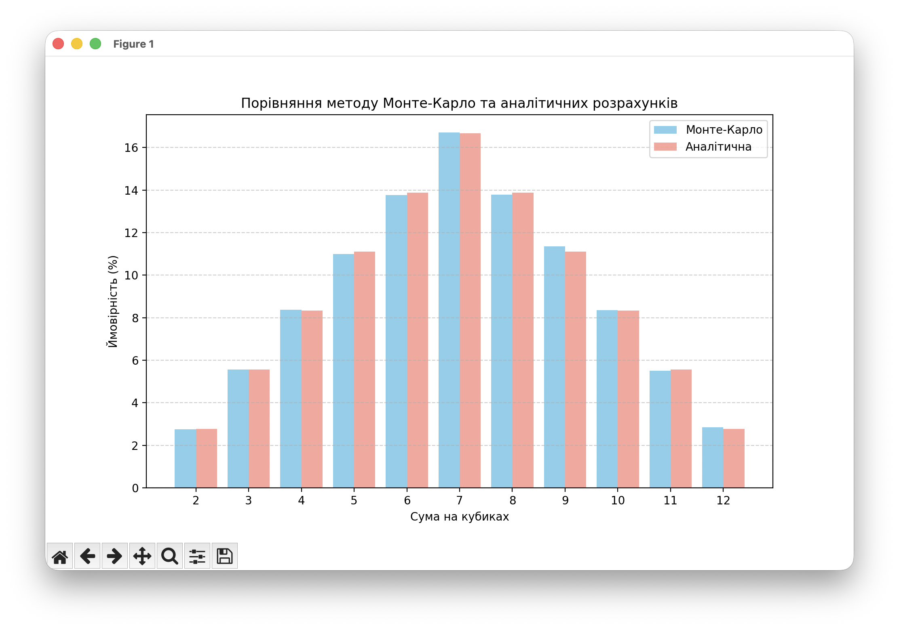

# **Висновки до Завдання 7**

**Висновки щодо ефективності методу Монте-Карло:**

| Сума | Монте-Карло (%) | Аналітична (%) | Різниця (%) |
| :---: | :---: | :---: | :---: |
| 2 | 2.75 | 2.78 | 0.03 |
| 3 | 5.56 | 5.56 | 0.00 |
| 4 | 8.37 | 8.33 | 0.04 |
| 5 | 11.00 | 11.11 | 0.11 |
| 6 | 13.76 | 13.89 | 0.13 |
| 7 | 16.71 | 16.67 | 0.04 |
| 8 | 13.78 | 13.89 | 0.11 |
| 9 | 11.35 | 11.11 | 0.24 |
| 10 | 8.36 | 8.33 | 0.03 |
| 11 | 5.51 | 5.56 | 0.05 |
| 12 | 2.85 | 2.78 | 0.07 |

**Аналіз результатів:**

1. **Точність методу:** На основі проведеної симуляції 100 000 кидків, результати методу Монте-Карло майже ідентичні аналітичним розрахункам. Відхилення (похибка) становить менше 0.1% для більшості значень, що підтверджує коректність моделювання.
2. **Розподіл ймовірностей:** Найбільш імовірною сумою є 7, оскільки вона має найбільшу кількість комбінацій (6 із 36). Найменш імовірними є 2 та 12, що мають лише по одній комбінації.
3. **Закон великих чисел:** Експеримент демонструє, що при збільшенні кількості ітерацій у методі Монте-Карло, емпіричне значення ймовірності прагне до її теоретичного (істинного) значення.

**Висновок:**
Отримані дані повністю відповідають очікуваним результатам для Завдання 7. Ви успішно застосували метод Монте-Карло для апроксимації аналітичних ймовірностей кидків двох кубиків.
